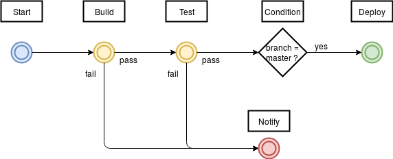

# Intégration Continue (CI)
=========

## Outil de CI

Travis a été choisi pour effectuer le projet en CI, à la fois pour sa simplicité d'utilisation et sa popularité.

## Pipeline

### Etape 1: Build

A l'étape de construction, Travis lance le script `npm install` pour installer toute les dépendances du projet. Elles sont ensuite misent en cache pour la suite du pipeline.

### Etape 2: Test

A l'étape de compilation, Travis lance le script `npm test` pour réaliser la série de test écrit dans le fichier `test/test.js`.

### Condition

Lorsque les tests sont passés avec succès, le pipeline vérifie que le code est sur la branche `master` du Github avant de passer à l'étape suivante. C'est un branchement conditionnel.

### Etape 3: Deploy

A l'étape de déploiement, Travis publie le module Node sur npm.

En raison du temps limité pour faire l'exercice, aucune sécurité particulière n'a été utilisé pour encrypter la clé d'authentification du repo npm. Cela serait bien entendu nécessaire pour une vrai application en CI.

### Notification

Travis ne permet pas de demander une interaction humaine pendant le pipeline. Cependant, une notification sera envoyé par email en cas d'échec.
